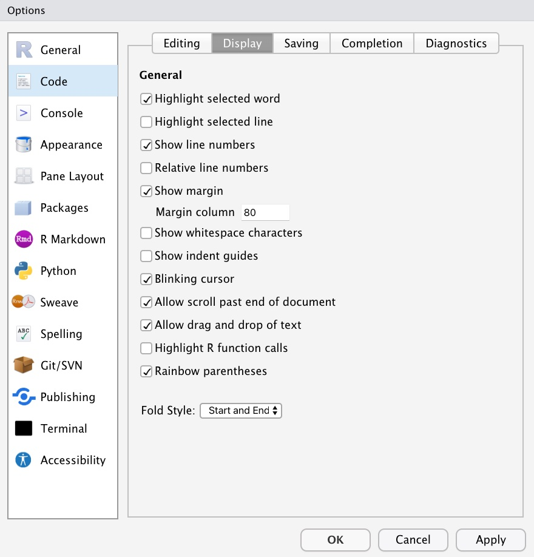

```{r setup, include=FALSE}
knitr::opts_chunk$set(eval = FALSE, 
                      warning = FALSE,
                      message = FALSE,
                      rows.print = 5)
```

## Code without space

```{r eval = FALSE}
# no space
library(package="tidyverse")
cars%>%ggplot(aes(x=speed,y=dist))+geom_point(color="purple")+theme_minimal()
```

---

background-image: url("galileo.jpg")
background-size: contain

<span role="img" aria-label="Slide background shows: image of Galileoo with a quote that says I-just-need-some-space"></span>

---

## Three different types of space

1) spacing before and after operators

2) line breaks or hard returns

3) indenting code

---

## Spacing before and after operators 


```{r eval = FALSE}
library(package = "tidyverse")
cars %>%  ggplot(aes(x = speed, y = dist)) + geom_point(color = "purple") + theme_minimal()
```

---

## Line breaks or hard returns

```{r eval = FALSE}
library(package = "tidyverse")

cars %>%  
ggplot(aes(x = speed, y = dist)) + 
geom_point(color = "purple") + 
theme_minimal()
```

---

## The 80 character rule

* Lines of code should be no longer than 80 characters (Shorter is even better!) 

* Counting your characters does not seem fun, keep to 80 characters or fewer with the help of R Studio:

   + Click on the `Tools` menu 
   
       + `Global Options` 
       
           + `Code` 
           
               + `Display` 
               
                   + `Show Margin` 

---

## Setting 80 character margin in R Studio
    
```{r echo = FALSE, eval = TRUE, fig.alt = "screenshot showing the R dialog box where you can change the margin to 80 characters", fig.align='center', out.width="50%"}

```

---

## Indenting code

* Multiline code that is all part of a single function or process can use indentation to show it belongs together

```{r eval = FALSE}
cars %>% 
  ggplot(aes(x = speed, y = dist)) + 
  geom_point(color = "purple") + 
  theme_minimal()
```

---

## When should I format my code?

* The best time to format your code is as you are coding

* The second best time is now

* This could induce a mild panic if you are looking at files with hundreds of lines of unformatted code

* Never fear, the `styler` package that can help

---

## The styler package for automatic formatting

If you write or receive code that is not well formatted, there are tools to save some time in formatting

* First, [styler](https://styler.r-lib.org) can style small amounts of code all the way to full documents

* To use styler, install it first, then choose one of the styler tools: 

    + `style_text()` function to style small amounts of code
    
    + `style_file()` function to style specified R or Rmd files
    
    + `style_dir()` function to style all R and Rmd files in a directory
    
    + `style_pkg()` function to style the source files for R packages
    
    + RStudio Addin to apply these functions from a drop-down menu
    
---

## Using styler

* Install the `styler` package

* Open your unformatted code file 

* Open the `tidyverse`

* Click the Addins menu in RStudio

* Choose `Style active file` from the menu

---

## Styler in action

```{r echo = FALSE, eval = TRUE, fig.alt = "Gif showing how styler works", out.width = "70%", fig.align='center'}
knitr::include_graphics('stylerforgif.gif')
```

---

background-image: url("drakestyler.jpg")
background-size: contain

<span role="img" aria-label="Slide background shows: meme of Drake shunning poorly formatted code but happy about well-formatted code"></span>

---

## Exercise

* Open the `unformatted-r-code.R` file and fix the formatting 

    + Add hard returns to keep lines short 
    
    + Add spaces after punctuation and around operators
    
    + Indent functions or processes that go together

* Choose an option: 

    + Fix the formatting by hand 
    
    + Fix the formatting by hand then then run `styler` to find anything missed 
    
    + Fix it using the `styler` package entirely


