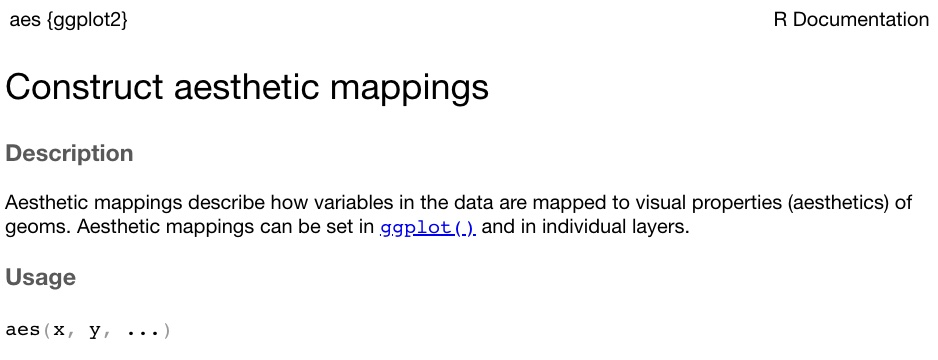

```{r setup, include=FALSE}
knitr::opts_chunk$set(eval = FALSE, 
                      warning = FALSE,
                      message = FALSE,
                      rows.print = 5)
```

## Lesson 5: Using function arguments

* There are two main types of arguments in most functions
    + arguments to specify data 
    + arguments to specify details of computation  
    
* For example, the `mean()` function has three arguments 
    + a data argument of `x = `
    + two detail arguments of `trim = ` and `na.rm = `
    
* Another example, plot, has eight arguments
    + two data arguments of `x = ` for the x-axis variable and `y = ` for the y-axis variable
    + six detail arguments of `type = `, `main = `, `sub = `, `xlab = `, `ylab = `, and `asp =`

---

## Knowing the arguments

* The help documentation lists function arguments for each function 
* For example, the `ggplot()` function has a `data = ` argument, a `mapping = ` argument, and an `environment = ` argument

* The `ggplot()` function also has room for other arguments where you see `...` in the help documentation

* The `ggplot()` function also calls the function, `aes()`, which has its own arguments

{fig.alt = "screenshot of help documentation for ggplot"}
---

## The aes() arguments 

* The `aes()` function within the `ggplot()` function has arguments as well

* It has two named arguments, `x` to specify what should go on the x-axis of the plot, and `y` to specify what should go on the y-axis of the plot

{fig.alt = "screenshot of help documentation for aes layer in ggplot}

--- 

## Positional use of arguments 

* Positional specification of the `ggplot()` arguments would be relying on the default order or **position** of the arguments

* For example, positional use of arguments would be adding the data frame name and `x` and `y` arguments without using `data = `, `mapping =`, `x =`, and `y = `, like this:

```{r}
library(package = "tidyverse")

# using positional specification to plot
# cars data speed on x-axis and distance on y-axis
ggplot(cars, aes(speed, dist)) +
  geom_point()
```

---

## Partial use of arguments

* Partial use of arguments is specifying some, but not all, of the arguments explicitly 

* The argument for data and other well-known arguments are often not specified 

* For `ggplot()` the `data = ` and `mapping = ` are often left out, but other arguments are used, like this: 

```{r}
# using partial specification to plot
# cars data speed on x-axis and distance on y-axis
ggplot(cars, aes(x = speed, y = dist)) +
  geom_point()
```

---

## Exact use of arguments

* Exact use of arguments is specifying all of the arguments explicitly

* For `ggplot()` it would look like this: 

```{r}
# using partial specification to plot
# cars data speed on x-axis and distance on y-axis
ggplot(data = cars, mapping = aes(x = speed, y = dist)) +
  geom_point()
```

---

## The benefits of exact and partial vs. position

* Exact and partial argument specification do not require you to remember the order of the arguments 

* When the argument is explicitly specified, the order does not matter

* When the argument is implied, as in positional specification, the order must be exactly right

* As an example, consider flipping the arguments in the `aes()` for the `ggplot()` of cars using positional specification and then using partial specification where `x = ` and `y = ` are used

```{r}
# using positional specification
ggplot(cars, aes(dist, speed)) +
  geom_point()

# using partial specification with x and y arguments
ggplot(cars, aes(y = dist, x = speed)) +
  geom_point()
```

---

## Demo

```{r echo = FALSE}
# add function arguments to a few functions in the participant file
```


---

## Exercise

* Open the participant `unformatted-r-code.R` file and add argument names where needed

---

## Resources
  
* [The tidyverse style guide](https://style.tidyverse.org/functions.html)

* [The Art of Readable Code](http://shop.oreilly.com/product/9780596802301.do) by Boswell & Foucher