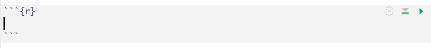
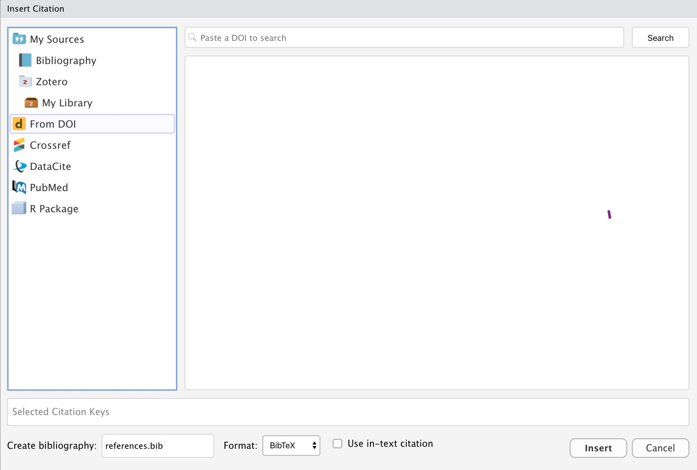

```{r setup, include=FALSE}
knitr::opts_chunk$set(eval = FALSE, 
                      warning = FALSE,
                      message = FALSE,
                      rows.print = 5)
```

## Lesson 9: Integrating code and text

* Even with annotated well-formatted clear code including a prolog, reproducibility can be hindered by having copying and pasting output from R into other types of documents 

* There is a solution, though, literate programming

* Literate programming tools allow you to combine code, output, and text in one document

* For R there are two options: R Markdown and Quarto

* Both tools are excellent for creating slides, documents, and web content

* Quarto is friendly to more coding languages and is in active development, while R Markdown is an older tool

---

## Creating a Quarto document

* In RStudio, open the File menu, choose New File, and choose Quarto document for a document or Quarto presentation for slides

{fig.alt = "screenshot of menu in RStudio for creating Quarto documents"}

---

## Writing text and code together in Quarto

* Quarto allows text and code to be included in a single document

* The text is written as you would usually write in any text editing software 

* The code is written in **code chunks** that are denoted by three backticks to start and end the chunk

{fig.alt = "screenshot of an R code chunk with no code in it"}

* If the code produces output, it will appear just below the code chunk

* When R Studio is left in the default style, the background is white where text is typed and light gray where code is typed

---

## Example Quarto document screenshot

{fig.alt = "screenshot of a Quarto document with some text, code, and a plot"}

---

## Text formatting basics

* In Quarto, text can be formatted to be section headers, bold, italic, and bullet points

* Section headers start with hashtags

    + The first heading will have one hashtag
    + The first subheading will have two hashtags
    + The second subheading will have three hashtags
    + and so on...
    
* To make type bold, add two asterisks `**` on each side of the word or section to be bolded

* To make type italic use a single `*` on each side of the word or section to be italicized

* Bullet points are denoted by an asterisk at the start of the line

    + Sub points are indented and denoted by `+`
    
* Numbered lists use the `1)` for each item, which is then automatically formatted to sequential numbers when rendered

---

## Using the visual editor for tables

* Well-formatted tables are notoriously difficult to create in R, but the built-in editor added to Quarto makes them easier 

* In Quarto switch to the Visual editor by clicking the Visual button in the top left corner

* Use the Table menu to insert a table and choose the number of rows and columns

{fig.alt = "screenshot of the visual editor table dialog box"}

* Type information directly into the table, adding rows and columns as needed

---

## Adding references in Quarto

* The visual editor in Quarto also works to add citations which knit into in-text citations and a reference section in your document

* The Insert menu in visual mode has an option to Insert Citation

* You can then type in citation information or search for documents to cite using the DOI or one of several search tools included in this feature

{fig.alt = "screenshot of the insert citation dialog box in Quarto"}

---

## Chunk options in R Markdown

* Typically documents we create for various audiences (e.g., reports, manuscripts, websites) do not contain statistical code, but do contain the output of code like tables and figures and various statistics

* When integrating text, code, and output into a single Quarto file that can be rendered as html, pdf, or Microsoft Word, it is to have a way to hide the code and any R messages the code produces that are not actual output

* Sometimes it might even be useful to hid certain output

* Showing or hiding the output, messages, and code can be done by using one of several arguments in the code chunks:

    + `eval` is `TRUE` to run the code or `FALSE` to not run the code 
    + `echo` is `TRUE` to show the code chunk or `FALSE` to hide the code chunk
    + `warning` is `TRUE` to show R warnings or `FALSE` to hide warnings
    + `message` is `TRUE` to show R messages or `FALSE` to hide messages

---

## Chunk options placement

* Chunk options are a special form of annotation within a chunk formatted with `#|` before the option and using a colon instead of equal sign, like this: `#| warning: false`

{fig.alt = "screenshot of the insert citation dialog box in Quarto"}

---

## Rendering a document

* To create the formatted document from the Quarto file, you will `render` the file

* When a file is rendered, the text and code chunk formatting is integrated with the text, code, and output into a single formatted document

* The formatted document can take many forms such as an html file, pdf file, or Microsoft Word document

---

## Rendering to Microsoft Word

* Rendering to Microsoft Word requires an additional step for creating a well-formatted document 

* A rendered Quarto file that is not linked to a template will be in the default format of a file created in the Microsoft Word program on your computer 

* This default Microsoft Word format often uses blue sans-serif type for section headings and other settings that often are inconsistent with the formatting preferred by the document author

* To create documents with specific fonts, font sizes, and uses of bold and other formats, a Microsoft Word template can be made

---

## Making a Microsoft Word template

1) Render your draft document in R Markdown or Quarto to a Word document 

1) Open the Word document and change the formatting to your preferred settings 

1) Save the Word document with a name like `template.docx`

1) Link the template in the YAML at the top of the document: 

{fig.alt = "screenshot of YAML showing the addition of a Microsoft Word template"}

---

## Demo

```{r echo = FALSE}
# demonstrate creating a new Quarto document and adding text and code from the provided files
# demonstrate creating a Microsoft Word template and using it to knit to Word
```


---

## Exercise

* Copy the demonstration to combine the text and code files and format for Rendering

* Try Rendering the file to html

* Try Rendering the file to Microsoft Word, creating and adding a template, and Rendering again

---

## Resources

* [R Markdown Cheat Sheet](https://www.rstudio.com/wp-content/uploads/2015/02/rmarkdown-cheatsheet.pdf)
* [R Markdown](https://rmarkdown.rstudio.com) from R Studio
* [R Markdown](https://r4ds.had.co.nz/r-markdown.html) from R for Data Science
* [R Markdown](https://cran.r-project.org/web/packages/rmarkdown/index.html) package documentation
* [Using RMarkdown to Create Reproducible Documents](https://www.youtube.com/watch?v=z2a80FnLFfE&t=98s) with Mine Çetinkaya-Rundel
* [Quarto Documentation](https://quarto.org)

