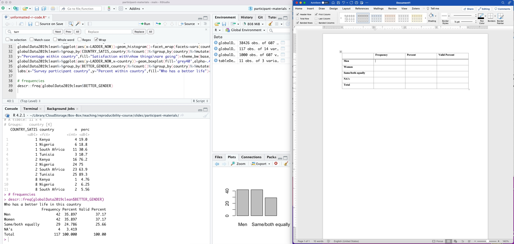
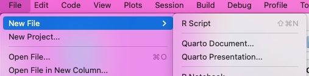
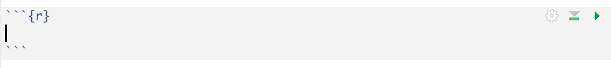
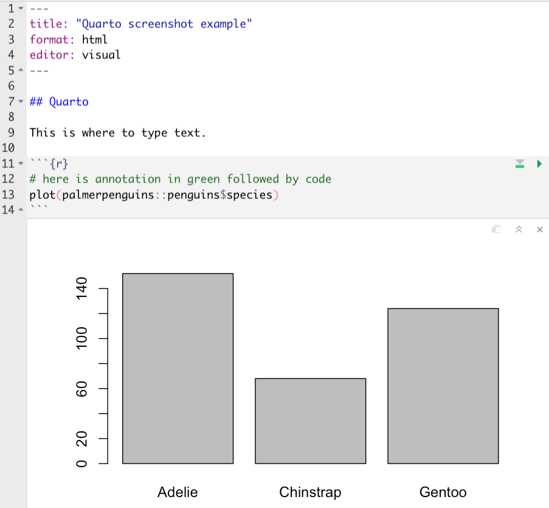
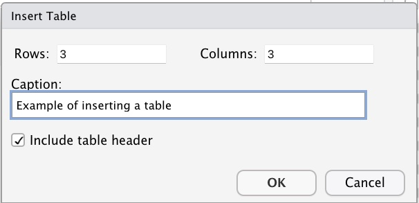
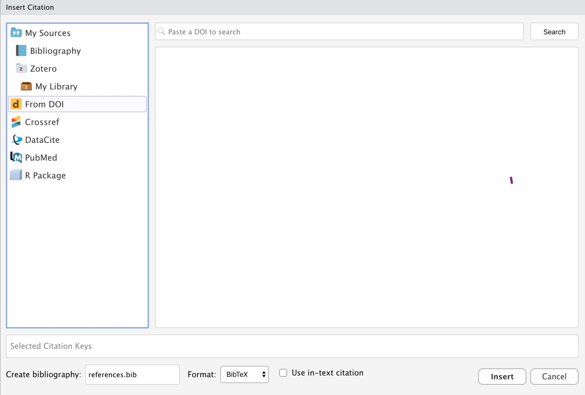
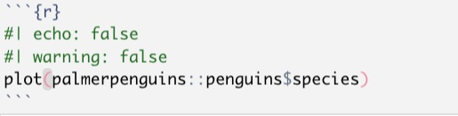

```{r setup, include=FALSE}
knitr::opts_chunk$set(eval = FALSE, 
                      warning = FALSE,
                      message = FALSE,
                      rows.print = 5)
```

## Does this look familiar?

```{r echo = FALSE, eval = TRUE, fig.alt = "screenshot of copying from R output to Word document", fig.align='center'}

```


---

background-image: url("images/reproducibility-paper-top.png")
background-size: contain

<span role="img" aria-label="Slide background shows: title page from a study of reproducibility of results from six papers"></span>

---

background-image: url("images/switching-rows-data.jpg")
background-size: contain

<span role="img" aria-label="Slide background shows: clip from a paper where a table was printed with three rows mislabeled"></span>

---

background-image: url("images/errors-transcribing.jpg")
background-size: contain

<span role="img" aria-label="Slide background shows: clip from a paper where frequencies were printed in the percent column and vice versa"></span>

---

background-image: url("images/p-value-typos.png")
background-size: contain

<span role="img" aria-label="Slide background shows: clip from a paper where p-values were reported as p=.001 rather than p < .001"></span>

---

background-image: url("images/error-superscripts.png")
background-size: contain

<span role="img" aria-label="Slide background shows: clip from a paper where superscripts indicating statistical significance were incorrectly added"></span>

---

background-image: url("images/yikesyikesyikes.jpg")
background-size: contain

<span role="img" aria-label="Slide background shows: stylized text that says yikes yikes yikes"></span>

---

## How does Quarto help?

--

* With Quarto you include the code, output, and the text in a single file, there is **no transcription**

--

* Because there is no transcription, updates in output due to changes in data management or analysis are automatically included

--

* Quarto has features that allow formatting similar to word processing programs

--

* Quarto can render documents in many formats including Microsoft Word and PDF

---

## Creating a Quarto document

--

* In RStudio, open the File menu, choose New File, and choose Quarto document for a document or Quarto presentation for slides

```{r echo = FALSE, eval = TRUE, fig.alt = "screenshot of menu in RStudio for creating Quarto documents", fig.align='center'}

```

---

## Writing text and code together in Quarto

--

* Quarto allows text and code to be included in a single document

--

* The text is written as you would usually write in any text editing software 

--

* The code is written in **code chunks** that are denoted by three backticks to start and end the chunk

```{r echo = FALSE, eval = TRUE, fig.alt = "screenshot of an R code chunk with no code in it", fig.align='center'}

```

---

## Example Quarto document screenshot

```{r echo = FALSE, eval = TRUE, fig.alt = "screenshot of a Quarto document with some text, code, and a plot", fig.align='center', out.width="50%"}

```

---

## Text formatting basics

--

* In Quarto, text can be formatted to be section headers, bold, italic, and bullet points

--

* Section headers start with hashtags

    + The first heading will have one hashtag
    
    + The first subheading will have two hashtags
    
    + The second subheading will have three hashtags
    
    + and so on...
    
---

## More text formatting
    
--

* To make type bold, add two asterisks `**` on each side of the word or section to be bolded

--

* To make type italic use a single `*` on each side of the word or section to be italicized

--

* Bullet points are denoted by an asterisk at the start of the line

    + Sub points are indented and denoted by `+`
    
--

* Numbered lists use the `1)` for each item, which is then automatically formatted to sequential numbers when rendered

---

## Using the visual editor for tables

--

* Well-formatted tables are notoriously difficult to create in R, but the built-in editor added to Quarto makes them easier 

--

* In Quarto switch to the Visual editor by clicking the Visual button in the top left corner

--

* Use the Table menu to insert a table and choose the number of rows and columns

--

* Type information directly into the table, adding rows and columns as needed

---

## Make a table

```{r echo = FALSE, eval = TRUE, fig.alt = "screenshot of the visual editor table dialog box", fig.align='center', out.width="50%"}

```

---

## Citations in Quarto

--

* The visual editor in Quarto also works to add citations which knit into in-text citations and a reference section in your document

--

* The Insert menu in visual mode has an option to Insert Citation

--

* You can then type in citation information or search for documents to cite using the DOI or one of several search tools included in this feature

---

## Inserting citations

```{r echo = FALSE, eval = TRUE, fig.alt = "screenshot of the insert citation dialog box in Quarto", fig.align='center', out.width="70%"}

```


---

## Chunk options in Quarto

--

* Showing or hiding the output, messages, and code can be done by using one of several arguments in the code chunks:

--

  + `eval` is `true` to run the code or `false` to not run the code 

--

  + `echo` is `true` to show the code chunk or `false` to hide the code chunk

--

  + `warning` is `true` to show R warnings or `false` to hide warnings

--

  + `message` is `true` to show R messages or `false` to hide messages

--

  + `results` is `true` to show results or `false` to hide results

---

## Chunk options placement

* Chunk options are a special form of annotation within a chunk formatted with `#|` before the option and using a colon instead of equal sign, like this: `#| warning: false`

```{r echo = FALSE, eval = TRUE, fig.alt = "screenshot of the insert citation dialog box in Quarto", fig.align='center', out.width="50%"}

```


---

## Rendering a document

--

* To create the formatted document from the Quarto file, you will `render` the file

--

* When a file is rendered, the text and code chunk formatting is integrated with the text, code, and output into a single formatted document

--

* The formatted document can take many forms such as an html file, pdf file, or Microsoft Word document

---

class: my-turn, center, middle

# Demo

```{r echo = FALSE}
# demonstrate creating a new Quarto document from the provided template and adding text and code from the provided files
# render to HTML
```


---

class: inverse

## Your Turn

--

* Copy the demonstration to combine the text and code files into the provided Quarto template (`quarto-template.qmd`) and format for rendering

--

* Try rendering the file to html


