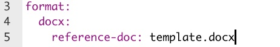

```{r setup, include=FALSE}
knitr::opts_chunk$set(eval = FALSE, 
                      warning = FALSE,
                      message = FALSE,
                      rows.print = 5)
```

## Rendering Quarto to Microsoft Word

--

* Rendering to Microsoft Word requires an additional step for creating a well-formatted document 

--

* A rendered Quarto file that is not linked to a template will be in the default format of a file created in the Microsoft Word program on your computer 

--

* To create documents with specific fonts, font sizes, and uses of bold and other formats, create a Microsoft Word template

---

## Creating a Microsoft Word template

--

1) Render your draft document in R Markdown or Quarto to a Word document 

--

2) Open the Word document and change the formatting to your preferred settings 

--

3) Save the Word document with a name like `template.docx`

--

4) Link the template in the YAML at the top of the document

---

## YAML with Word template

```{r echo = FALSE, eval = TRUE, fig.alt = "screenshot of YAML showing the addition of a Microsoft Word template", fig.align='center', out.width="50%"}

```

---

class: my-turn, center, middle

# Demo

```{r echo = FALSE}
# demonstrate creating a Microsoft Word template and using it to knit to Word
```

---

class: inverse

## Your Turn

--

* Render the file to Microsoft Word 

--

* Create and add a template

--

* Render again


